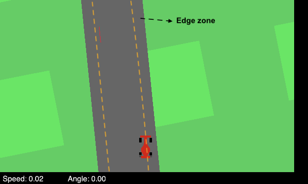

# Introduction

**Authors:**Lin-Chi Wu (l.wu@student.tue.nl), Zengjie Zhang (z.zhang3@tue.nl)

This git repository is a storage of coding and demonstrating for reinforcement learning with risk awareness.

## Environment and setup
* The running program is running with python environment. The sugestted python installed base: `Python 3.8.15`.
* For the most nicest experience and observaion, one can use the `jupyternotebook`.
* Conda environments and the basic package version are presented along side with the repository.

---

## Training file
The training file for 3 algorithms are displayed in [`Train_DDPG.ipynb`](/Train_DDPG.ipynb), [`Train_DQN.ipynb`](/Train_DQN.ipynb) and [`Train_PPO.ipynb`](/Train_PPO.ipynb).

## Demonstrate (test the trained agent) file
One can observe the trained agent's (after training with 1000 episodes) behavior with [`LoadModelNTest.ipynb`](/LoadModelNTest.ipynb)

# The instance of out of track and near the edge zone. 

According to review, it is still lack of the evaluation with a fair standard for different agents experience at the same environment. The new evaluation method is proposed to evaluate the agent's performance with the same environment and they are evaluated not just by the reward but also agents' behaviors counter act to the environment, i. e. the strategy.  

We think that the agent has a good strategy of being inside the track and can survive longer during the playing round by showing that the game is less likely to be terminated due to out of the track. In addition, the agent can drive smoothly so that it is less frequently turning angles whlie remaining in the track. We propose the evaluation method by counting the number of out of track and the number of touching the track's edge. We consider an agent cannot drive stable when it consistently turning driving directions avoiding out of the track near the edge. 
The lower number of out of track and driving stable, the better strategy of the agent.  

## Two parameters to evaluate the agent's strategy
We want these two factors as low as possible.

* Out of the track.
* The instance of the agent approach the edge zone.

*The edge zone area the place is between the green area and the yellow dash line.*

